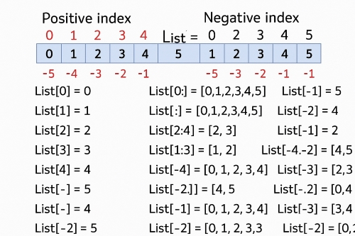

🔢 Python Data Structures Comparison Table

| Feature / Data Structure                                    | **List [  ]** | **Set{ }** | **Tuple(,)** |   **Dict{""}**   |
| ----------------------------------------------------------- | :------------------: | :--------------: | :----------------: | :--------------------: |
| **Mutable(Can be changed after creation)**            |        ✅ Yes        |      ✅ Yes      |       ❌ No       |         ✅ Yes         |
| **Ordered(mainains inseration order)**                |        ✅ Yes        | ✅ Yes (Py 3.7+) |       ✅ Yes       |         ✅ Yes         |
| **Allows Duplicates(You can have repeated elements)** |        ✅ Yes        |      ❌ No      |       ✅ Yes       |      ❌ No (keys)      |
| **Indexed(Supports postive and negative indexin)**    |        ✅ Yes        |      ❌ No      |       ✅ Yes       | ✅ Yes (keys as index) |
| **Heterogeneos(Allows Different Data Types)**         |        ✅ Yes        |      ✅ Yes      |       ✅ Yes       | ✅ Yes (keys & values) |

| Data Structure  | Allowed Data Types                                                                                          |
| --------------- | ----------------------------------------------------------------------------------------------------------- |
| **List**  | Any:`int`, `float`, `str`, `bool`, `list`, `tuple`, `dict`, `set`, `None`, custom objects |
| **Set**   | Immutable types only:`int`, `float`, `str`, `tuple` (with immutable contents). ❌ No lists or dicts |
| **Tuple** | Any: same as list, including mutable types like lists or dicts                                              |
| **Dict**  | **Keys:** Immutable types only ` ` **Values:** Any type                                    |

List Indexing and Slicing

List = [0, 1, 2, 3, 4, 5]

### LIst[start index:end index+1:step] (String, Tuples, NUmpy and Pandas follow the same Slicing Model)

Example: [0:5:2] - it skip one value due to 2

| Value  | 0  | 1  | 2  | 3  | 4  | 5  |
| ------ | -- | -- | -- | -- | -- | -- |
| +Index | 0  | 1  | 2  | 3  | 4  | 5  |
| -Index | -6 | -5 | -4 | -3 | -2 | -1 |

List Methods

 lst = [1, 2, 3]

| Function       | Description                                               | Example                            |
| -------------- | --------------------------------------------------------- | ---------------------------------- |
| `append()`   | Adds an element to the end of the list                    | `lst.append(10)` → `[1,2,10]` |
| `pop()`      | Removes and returns the last element                      | `lst.pop()` → removes `10`    |
| `copy()`     | Returns a shallow copy of the list                        | `new_lst = lst.copy()`           |
| `del`        | Deletes the entire list or a specific element by index    | `del lst[0]` or `del lst`      |
| `clear()`    | Removes all elements from the list                        | `lst.clear()` → `[]`          |
| `remove()`   | Removes the first occurrence of a specified value         | `lst.remove(2)`                  |
| `sort()`     | Sorts the list in ascending (default) or descending order | `lst.sort(reverse=True)`         |
| `reverse()`  | Reverses the order of elements in the list                | `lst.reverse()`                  |
| `+` (Concat) | Combines two lists                                        | `lst + [4,5]` → `[1,2,4,5]`   |
| `index()`    | Returns the index of the first matching value             | `lst.index(2)` → `1`          |
| `extend()`   | Adds multiple elements to the end of the list             | `lst.extend([4,5])`              |
| `len()`      | Returns the number of elements in the list                | `len(lst)` → `3`              |
| `insert()`   | Inserts an element at a specific position                 | `lst.insert(0, "a")`             |
| `count()`    | Counts how many times a value appears in the list         | `lst.count(2)` → `1`          |

##### **Tuple**

we can`t add but we can concat the tuple tuple=(10,20,30)+(40,). To add an element there is no method list appened or addd like list. We can convert the tuple to list and add the elements and covert back to tuple

##### SET

pop- it will remove randomly any element, remove- to specfic element

##### Dictionary

add or update student['name'] = 'Raj', del to delete the Keys of the elment, pop(Key:value),update(to add mutiple elements),popitem(to remove specific element(key:value)),

STRING

| Method           | Description                                              | Example                                        |
| ---------------- | -------------------------------------------------------- | ---------------------------------------------- |
| `upper()`      | Converts all characters to uppercase                     | `"hello".upper()` → `"HELLO"`             |
| `lower()`      | Converts all characters to lowercase                     | `"HeLLo".lower()` → `"hello"`             |
| `title()`      | Capitalizes the first letter of each word                | `"hello world".title()` → `"Hello World"` |
| `capitalize()` | Capitalizes only the first letter of the string          | `"hello".capitalize()` → `"Hello"`        |
| `strip()`      | Removes leading and trailing spaces                      | `"  hello  ".strip()` → `"hello"`         |
| `lstrip()`     | Removes leading spaces                                   | `"  hello".lstrip()` → `"hello"`          |
| `rstrip()`     | Removes trailing spaces                                  | `"hello  ".rstrip()` → `"hello"`          |
| `replace()`    | Replaces a substring with another                        | `"hello".replace("e", "a")` → `"hallo"`   |
| `split()`      | Splits the string into a list using a delimiter          | `"a,b,c".split(",")` → `['a','b','c']`    |
| `join()`       | Joins elements of a list into a string                   | `".".join(['a','b'])` → `"a.b"`           |
| `find()`       | Returns the index of the first occurrence of a substring | `"hello".find("e")` → `1`                 |
| `count()`      | Counts how many times a substring appears                | `"hello".count("l")` → `2`                |
| `startswith()` | Returns True if string starts with specified prefix      | `"hello".startswith("he")` → `True`       |
| `endswith()`   | Returns True if string ends with specified suffix        | `"hello".endswith("o")` → `True`          |
| `isalpha()`    | Returns True if all characters are alphabetic            | `"hello".isalpha()` → `True`              |
| `isdigit()`    | Returns True if all characters are digits                | `"123".isdigit()` → `True`                |
| `isalnum()`    | Returns True if all characters are alphanumeric          | `"abc123".isalnum()` → `True`             |
| `isupper()`    | Returns True if all characters are uppercase             | `"HELLO".isupper()` → `True`              |
| `islower()`    | Returns True if all characters are lowercase             | `"hello".islower()` → `True`              |
| `swapcase()`   | Swaps uppercase to lowercase and vice versa              | `"HeLLo".swapcase()` → `"hEllO"`          |

##### Control Stmt

if-elseif -else, nested if

Loops

For loop

    Iterrtive over a range, iterrative over a string or any object

While Loop The loop contuines to execute as long as condition is TRUE

BREAK -  The break stts exists the loop permaturely

Continue - The contuine stme skips the current iteration and countine with the next.

Pass - It is a null operation, it does nothing
